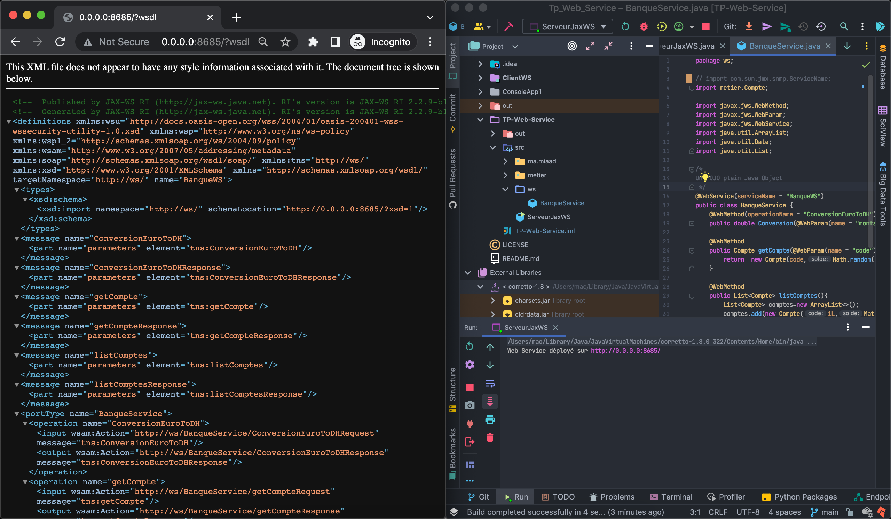
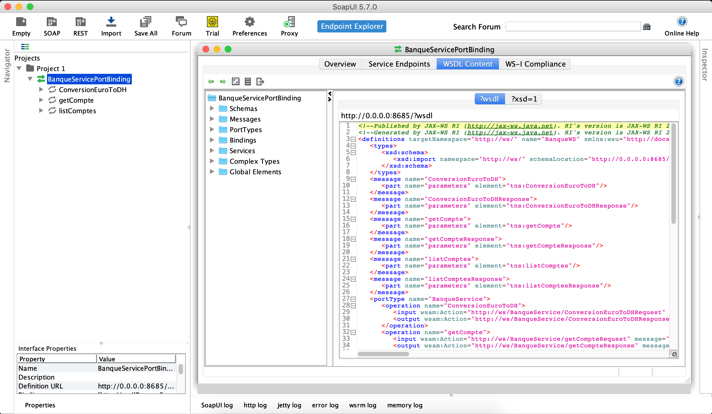
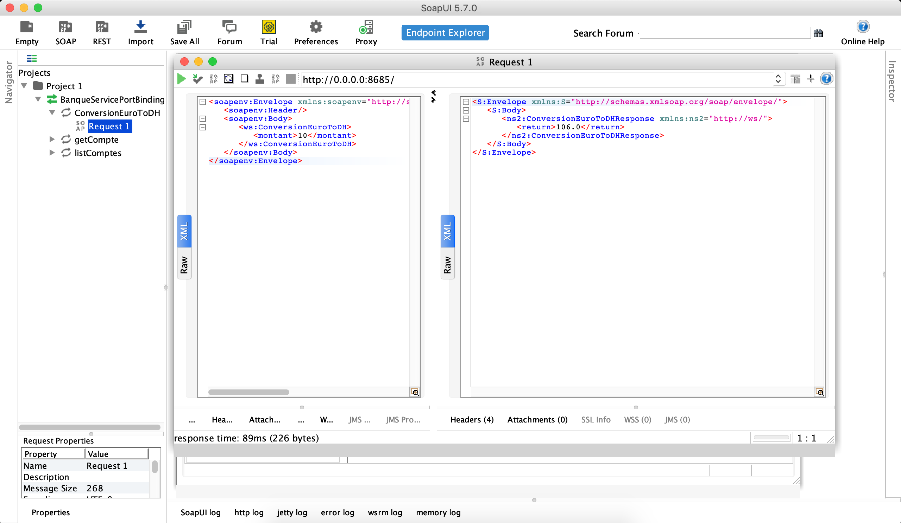
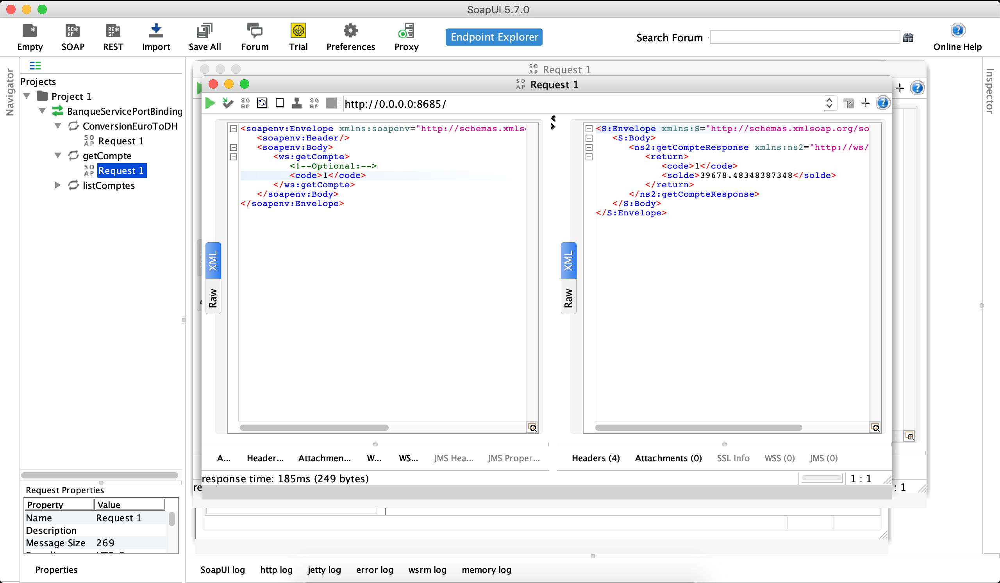
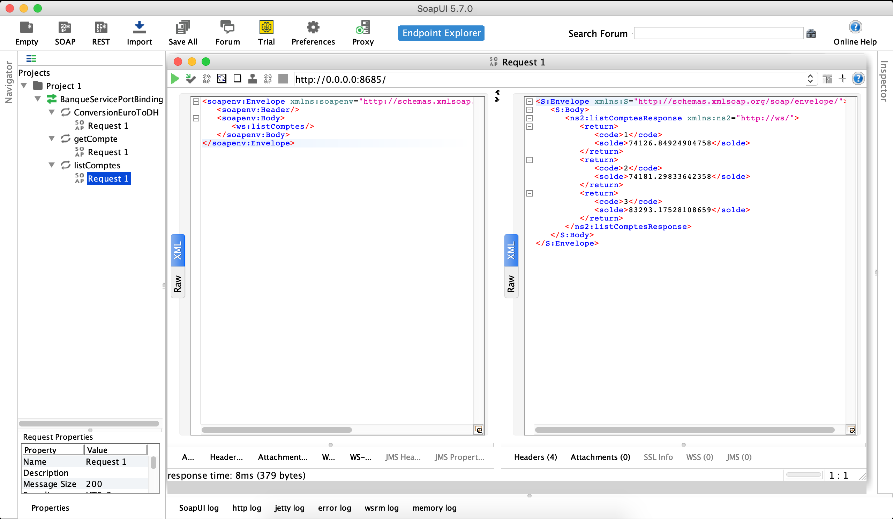
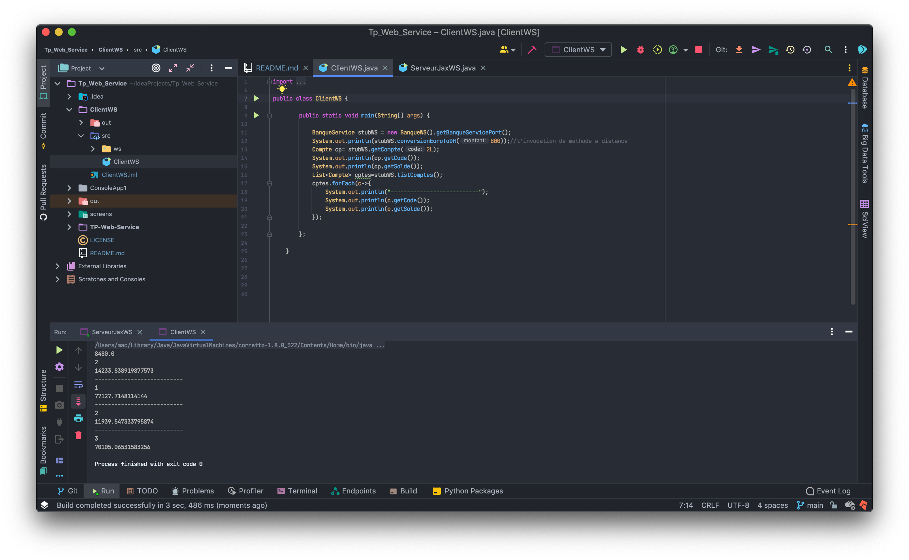

# TP Web Service

# Partie 1:
## Creation d'un web service et une simple application java pour le consommer :

## 1. Lancer serveur

## 2. Web service et SoapUI

Les methodes trouvés dans le web service et on peut les testés avec SoapUI:

#### 2.1 Methode CoversionEuroToDH():

#### 2.2 Methode getCompte():

#### 2.3 Methode listeComptes():

## 3. Application java pour le client

# Partie 2 : consommer Notre web service dans une application .Net

 
 
 
